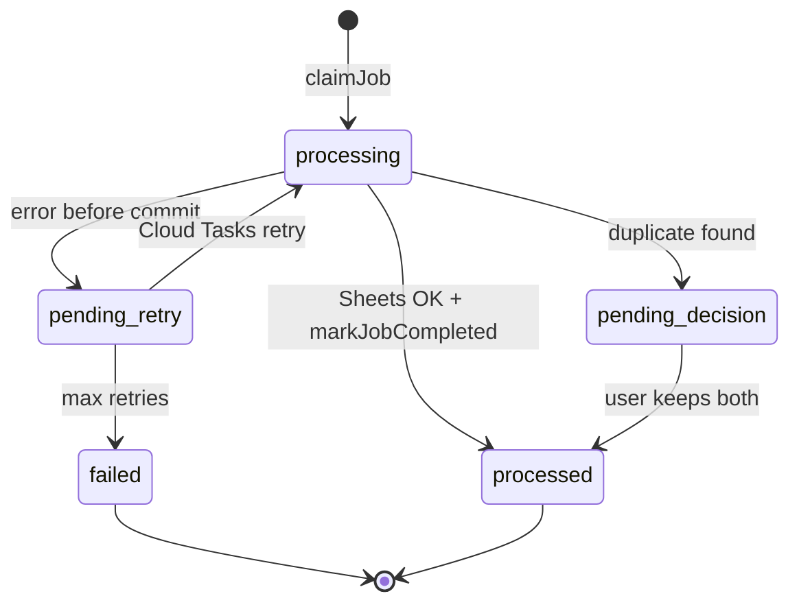

# Architecture

## Overview

Invofox has two main write paths that touch **Cloud Storage**, **Google Sheets**, and **Firestore**:

| Flow | Trigger | Entry service | Async? |
|------|---------|---------------|--------|
| **Invoice upload (OCR)** | User sends photo/PDF in Telegram | `webhook-handler` → Cloud Tasks → `worker` `/process` | Yes (Cloud Tasks retries) |
| **Document creation** | `/new` → confirm (buttons or NL voice/text) | `webhook-handler` → Cloud Tasks → `worker` `/invoice/*` | No job queue; synchronous callback with optional user retry |

```
┌──────────┐     ┌─────────────────┐     ┌───────────┐     ┌────────┐
│ Telegram │────▶│ webhook-handler │────▶│Cloud Tasks│────▶│ worker │
└──────────┘     └─────────────────┘     └───────────┘     └────────┘
                       │                                        │
                       │  /new, callbacks (sync HTTP)             │
                       └──────────────────────────────────────────┘
                                                                │
                         ┌──────────────────────────────────────┤
                         ▼                 ▼                    ▼
                   ┌───────────┐    ┌───────────┐    ┌────────────────┐
                   │  Storage  │    │  Sheets   │    │   Firestore    │
                   │ (images + │    │ Invoices /│    │ jobs + config +│
                   │ gen PDFs) │    │ Generated │    │ generated docs │
                   └───────────┘    └───────────┘    └────────────────┘
```

## Services

| Service | Role |
|---------|------|
| `webhook-handler` | Receives Telegram webhooks, enqueues Cloud Tasks |
| `worker` | OCR pipeline, document generation, PDF reports, onboarding |
| Cloud Tasks | Retry with backoff for invoice upload (`/process`) |
| Firestore | Job tracking (`invoice_jobs`), business config, generated documents, sessions |
| Cloud Storage | Uploaded invoice images/PDFs; generated document PDFs |

---

## Persistence, rollback & retry

Both flows follow the same **compensating-saga** rule: **do not leave committed user-visible state unless all required stores succeeded**. Google Sheets is the commit gate before Firestore job/document fields are finalized (upload) or before generated-document records are written (creation).

### Retry layers

| Layer | Applies to | Mechanism | Typical duration |
|-------|------------|-----------|------------------|
| **1. Sheets API** | Upload + creation | `withSheetsRetry` — 5 attempts, exponential backoff (1s → 8s cap) on transient errors (`ERR_STREAM_PREMATURE_CLOSE`, 429, 5xx) | ~15–60s per call |
| **2. Cloud Tasks** | Invoice upload only | HTTP 500 → queue retry; `MAX_RETRIES` (default **6**); job status `pending_retry` | Minutes |
| **3. User retry** | Document creation only | On transient failure: session kept, `reservedInvoiceNumber` preserved, user taps **Approve** again | User-driven |

Sheets tab setup (`ensureInvoicesTab`, `ensureGeneratedInvoicesTab`) uses the same retry wrapper and metadata fallbacks: if `values.get` flakes but the tab exists (or metadata also flakes), header sync is skipped and append proceeds.

**HTTP client note:** `google-api-http.ts` configures `googleapis` with `keepAlive: false` to avoid spurious `ERR_STREAM_PREMATURE_CLOSE` on Node 24.17+ (see [nodejs/node#63989](https://github.com/nodejs/node/issues/63989)). Long-term, prefer Node ≥ 24.18 in the worker image when available.

### Invoice upload (OCR) pipeline

```
Telegram file
     │
     ▼
┌─────────────┐    ┌──────────────┐    ┌─────────────┐
│ 1. Download │───▶│ 2. Upload    │───▶│ 3. LLM      │
│  from TG    │    │  to GCS      │    │  extraction │
└─────────────┘    │ (track paths)│    └─────────────┘
                   └──────────────┘           │
                                              ▼
                                    ┌─────────────────┐
                                    │ Duplicate check │
                                    └────────┬────────┘
                                             │
                         ┌───────────────────┴───────────────────┐
                         ▼                                       ▼
                 ┌───────────────┐                    ┌────────────────┐
                 │ Pause: user   │                    │ 4. Sheets      │
                 │ decision      │                    │ append (gate)  │
                 └───────────────┘                    └───────┬────────┘
                                                              │
                              ┌───────────────────────────────┴───────────────────────────────┐
                              ▼ success                                                       ▼ failure
                    ┌─────────────────────┐                              ┌──────────────────────────────┐
                    │ 5. Commit job:      │                              │ Rollback:                    │
                    │ storeExtraction +   │                              │ • delete GCS file(s)         │
                    │ markJobCompleted    │                              │ • clearJobArtifacts (FS)     │
                    │ 6. Telegram ACK     │                              │ • markJobPendingRetry        │
                    └─────────────────────┘                              │ • throw → Cloud Tasks retry  │
                                                                         └──────────────────────────────┘
```

**Commit order (happy path):** GCS upload → LLM (memory) → **Sheets append** → `storeExtraction` + `markJobCompleted` → Telegram success message.

**Deferred until Sheets succeeds:** `driveLink`, `driveFileId`, extraction fields, `sheetRowId`, LLM usage fields on `invoice_jobs`. The user gets **no success reply** while the job is `pending_retry`.

**Rollback on Sheets failure:**

| Store | Action |
|-------|--------|
| Cloud Storage | `rollbackUploadedFiles` — delete uploaded image/PDF |
| Firestore `invoice_jobs` | `clearJobArtifacts` — remove uncommitted `driveLink`, extraction, `sheetRowId`, etc. |
| Google Sheets | Nothing written yet |
| Telegram | No ACK until final success or permanent failure |

**Job statuses (`invoice_jobs`):**

| Status | Meaning |
|--------|---------|
| `processing` | Worker claimed the job |
| `pending_retry` | Transient failure; Cloud Tasks will retry |
| `processed` | Committed (Sheets + job fields) |
| `failed` | Max retries exhausted; user notified |
| `pending_decision` | Duplicate detected; awaiting user buttons |



### Document creation pipeline (`/new` → Approve)

Applies to classic button flow and NL flow (after confirm). PDF is built in memory; persistence follows the same gate pattern as OCR.

```
Session (confirming)
     │
     ▼
┌──────────────┐    ┌──────────────┐    ┌─────────────────────┐
│ Reserve doc  │───▶│ Generate PDF │───▶│ Upload PDF to GCS   │
│ number       │    │ (memory)     │    │ (generated-invoices)│
└──────────────┘    └──────────────┘    └──────────┬──────────┘
                                                    │
                                                    ▼
                                          ┌─────────────────────┐
                                          │ Sheets: Generated   │
                                          │ Invoices append     │
                                          │ (commit gate)       │
                                          └──────────┬──────────┘
                                                     │
                     ┌───────────────────────────────┴───────────────────────────────┐
                     ▼ success                                                       ▼ failure
           ┌─────────────────────┐                              ┌──────────────────────────────┐
           │ Firestore: save     │                              │ Rollback (reverse order):    │
           │ generated doc       │                              │ • reverse parent payment     │
           │ (+ receipt parent   │                              │   (if receipt, was updated)  │
           │  payment updates) │                              │ • delete Firestore doc       │
           └─────────┬───────────┘                              │ • delete GCS PDF             │
                     ▼                                          └──────────────────────────────┘
           ┌─────────────────────┐                                          │
           │ Send PDF in Telegram│                              ┌─────────────▼──────────────┐
           └─────────────────────┘                              │ Transient? keep session +  │
                                                                │ reservedInvoiceNumber,     │
                                                                │ show Approve again         │
                                                                └────────────────────────────┘
```

**Commit order (happy path):** GCS → **Sheets (`Generated Invoices` tab)** → Firestore `generated_*` record → parent invoice payment updates (receipts only) → Telegram PDF.

**Rollback flags** (`generateInvoice`): tracks `storageUploaded`, `firestoreSaved`, `parentPaymentUpdated` and unwinds only what was committed.

| Failure after… | Rollback |
|----------------|----------|
| Sheets | Delete GCS PDF only |
| Firestore | Delete GCS PDF |
| Parent payment (receipt) | Reverse payment, delete Firestore doc, delete GCS PDF |

**User retry (layer 3):** On transient errors (`isTransientGenerationError`), the session stays in `confirming` with `reservedInvoiceNumber` so **Approve** reuses the same document number without consuming a new counter.

**Not rolled back:** Document counter increment (gap on failure is acceptable). Rare edge case: if Firestore fails after Sheets succeeds, a sheet row may exist without a matching Firestore doc (same class of limitation as distributed sagas without two-phase commit).

### Side-by-side comparison

| | Invoice upload | Document creation |
|--|----------------|-------------------|
| **Commit gate** | `Invoices` tab append | `Generated Invoices` tab append |
| **GCS bucket** | `storageBucket` (images/PDFs) | `generatedInvoicesBucket` |
| **Firestore** | `invoice_jobs` | `generated_invoices` / `generated_receipts` / `generated_invoice_receipts` |
| **Async retry** | Cloud Tasks (`pending_retry`) | None (user taps Approve again) |
| **User message on transient fail** | Silence until success or final failure | Error + “press Approve again” (transient) or `/new` (permanent) |

---

## Invoice upload (OCR)

End-to-end path for photos, PDFs, and HEIC sent in a customer group.

```
Telegram photo/PDF → webhook-handler → Cloud Tasks → worker /process
  → download → convert (PDF/HEIC) → upload GCS → LLM extract → duplicate check
  → Sheets append → markJobCompleted → Telegram ACK
```

| Step | `PipelineStep` | Side effects |
|------|----------------|--------------|
| Claim | — | `invoice_jobs` claimed (idempotent) |
| Download | `download` | — |
| Upload | `drive` | GCS file(s); paths tracked for rollback |
| LLM | `llm` | Extraction in memory only |
| Sheets | `sheets` | Row appended; **commit gate** |
| ACK | `ack` | Job completed + Telegram reply |

Implementation: `services/worker/src/services/invoice.service.ts`.

---

## Document generation

### Command: `/new`

Creates invoices, receipts, and invoice-receipts through guided flow.

```
/new → Document Type Selection → Details Entry → Confirmation → PDF Generation
                 ↓
           Receipt Flow (if receipt selected)
                 ↓
    Open Invoices Query → Invoice Selection → Payment Amount → Validation
```

### Document type system

**Invoice (I-{year}-{counter})**
- Separate counters per customer per year
- Payment tracking: `paymentStatus`, `paidAmount`, `remainingBalance`
- Stored in `generated_invoices`

**Receipt (R-{year}-{counter})**
- Links to existing invoice(s); validates amount against remaining balance
- Updates parent invoice payment status after commit
- Stored in `generated_receipts`

**Invoice-receipt (IR-{year}-{counter})**
- Combined document for immediate payment; marked fully paid on creation
- Stored in `generated_invoice_receipts`

### Natural-language document creation (feature flag: `nl-document-creation`)

When enabled per chat, `/new` starts a voice/text intent flow instead of button-based type selection.

```
/new (FF on) → voice/text intent → LLM parse (Gemini → OpenAI fallback)
      → review/edit screen → missing-field prompts → confirm → PDF generation
```

- Supported v1 types: `invoice`, `invoice_receipt` (receipt-on-existing-invoice uses classic button flow)
- Voice: Telegram `.ogg` → Gemini audio-in; OpenAI audio fallback (+ Whisper tertiary)
- State in `invoice_sessions` (`awaiting_intent`, `reviewing`, `editing_field`, `confirming`)
- On confirm: `reservedInvoiceNumber` stored before generation for safe user retry

### Payment tracking flow

```
Invoice Created (status: unpaid, balance: full amount)
         ↓
Receipt Created (partial: 50%)
         ↓
Invoice Updated (status: partial, balance: 50%)
         ↓
Receipt Created (full: remaining 50%)
         ↓
Invoice Updated (status: paid, balance: 0)
```

| Component | Purpose |
|-----------|---------|
| `config.service` | Per-customer business config |
| `pdf.generator` | Playwright-based PDF rendering |
| `counter.service` | Atomic document numbering (per type) |
| `open-invoices.service` | Query unpaid/partial invoices (limit 10) |
| `session.service` | Document creation flow state |
| `index.ts` (`generateInvoice`) | Orchestration, commit order, rollback |
| `sheets.service` | `Invoices` + `Generated Invoices` tabs |
| `google-api-http.ts` | Google API HTTP agent configuration |

---

## Firestore collections

| Collection | Purpose | Key fields |
|------------|---------|------------|
| `invoice_jobs` | OCR upload pipeline state | `status`, `lastStep`, `lastError`, `driveLink`, `sheetRowId`, `llmProvider` |
| `generated_invoices` | Invoice documents | `paymentStatus`, `paidAmount`, `remainingBalance`, `relatedReceiptIds` |
| `generated_receipts` | Receipt documents | `relatedInvoiceNumber`, multi-invoice fields |
| `generated_invoice_receipts` | Invoice-receipt documents | Combined payment documents |
| `invoice_sessions` | Document creation flow | `status`, `documentType`, `reservedInvoiceNumber`, `nlMode` |
| `invoice_counters` | Atomic counters per type | `invoice`, `receipt`, `invoice_receipt` per year |
| `business_configs` | Per-customer branding | `sheetId`, logo, signature text |

---

## Google Sheets tabs

| Tab | Used by | Append function |
|-----|---------|-----------------|
| `Invoices` | OCR upload | `appendRow` |
| `Generated Invoices` | `/new` document creation | `appendGeneratedInvoiceRow` |

Both paths call `ensure*Tab` before append (create tab + headers if missing, with retries and metadata fallback).
